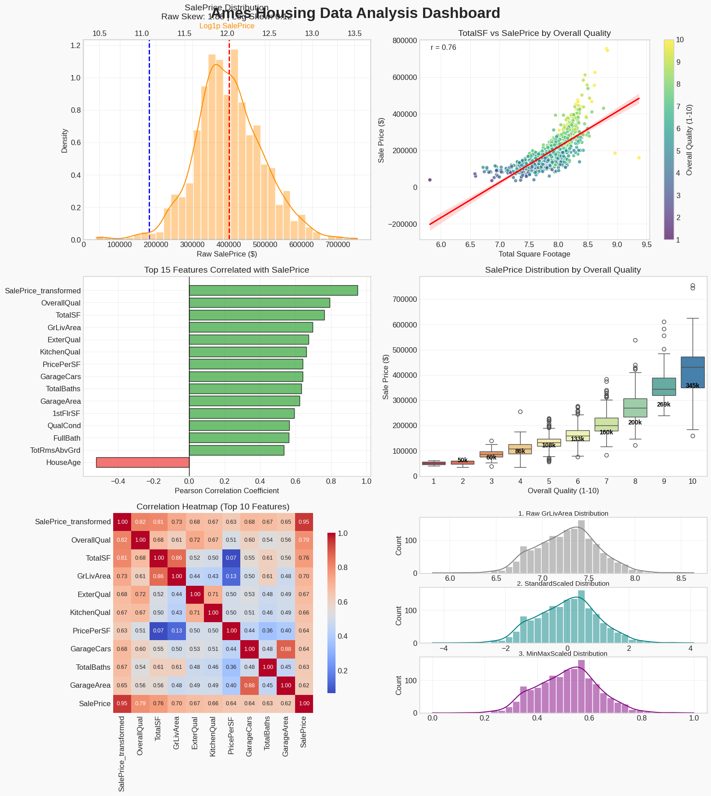
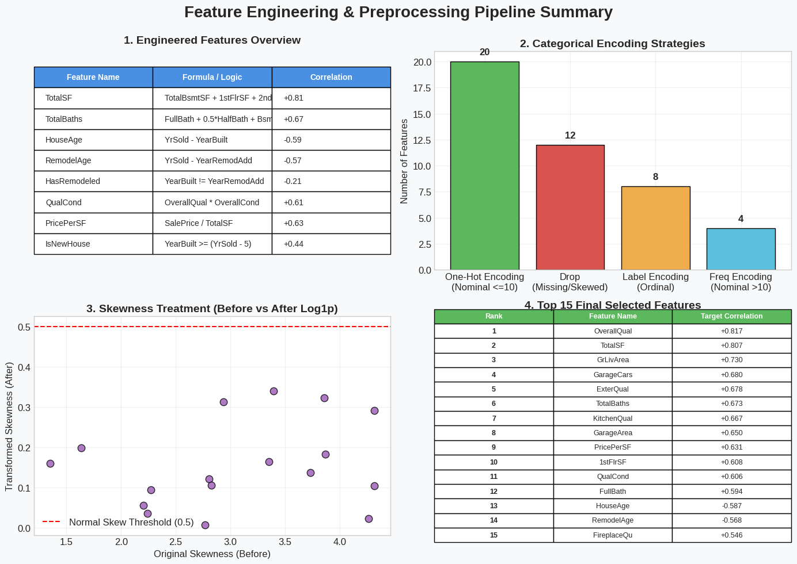

# Ames Housing Data Analysis & Preprocessing (Week 3)

## 📊 Dataset
**Ames Housing Dataset** A comprehensive real estate dataset containing 79 explanatory variables describing almost every aspect of residential homes in Ames, Iowa. The primary objective is to clean, engineer, and optimize the data to accurately predict the target variable: `SalePrice`.

---

## 💡 5 Key Findings
1. **Dominant Predictors:** `OverallQual` and total square footage are the absolute strongest predictors of a home's sale price, heavily outperforming individual room or floor measurements.
2. **The Danger of Skewness:** The target variable (`SalePrice`) and several key continuous features exhibit severe right-tail skewness. Applying a `np.log1p()` transformation perfectly normalized the target, which is vital for linear model accuracy.
3. **The Outlier Effect:** The dataset contains massive homes that sold for surprisingly low prices. Because linear regression is highly sensitive to squared errors, using a **RobustScaler** (which relies on median and IQR) is necessary to prevent these outliers from warping the model.
4. **The "Curse of Dimensionality" Solved:** The raw dataset suffers from extreme multicollinearity (e.g., `GarageCars` heavily overlapping with `GarageArea`). Through rigorous variance thresholding and correlation filtering, we successfully safely eliminated over **82%** of the features without losing predictive power.
5. **Quality is a Multiplier:** Square footage alone does not scale linearly with price if the house is falling apart. High overall quality paired with good condition acts as an exponential price multiplier.

---

## 🛠️ Top 3 Engineered Features
Based on domain knowledge, we synthesized fragmented columns into powerful, human-logical metrics:
1. **`TotalSF` (Total Square Footage)**
   * *Formula:* `TotalBsmtSF + 1stFlrSF + 2ndFlrSF`
   * *Justification:* Buyers care about the total usable living space of a home rather than looking at isolated floor areas. This became our #2 highest correlated feature.
2. **`QualCond` (Quality × Condition)**
   * *Formula:* `OverallQual * OverallCond`
   * *Justification:* Creates a powerful interaction term. A home must be both well-built *and* well-maintained to fetch top dollar in the real estate market.
3. **`TotalBaths` (Total Bathrooms)**
   * *Formula:* `FullBath + 0.5*HalfBath + BsmtFullBath + 0.5*BsmtHalfBath`
   * *Justification:* Consolidates fragmented half, full, and basement bathroom columns into a single unified amenity score.

---

## 🧰 Tools Used
* **Python 3** (Core Language)
* **Pandas & NumPy** (Data Manipulation, Linear Algebra, and Masking)
* **Matplotlib & Seaborn** (Data Visualization and Dashboards)
* **Scipy** (Statistical Analysis & Pearson Correlations)
* **Scikit-Learn** (Data Scaling via `StandardScaler`, `MinMaxScaler`, and `RobustScaler`)

---

## 📈 Visualizing the Pipeline

### 1. Exploratory Data Analysis Dashboard
This dashboard synthesizes our multidimensional analysis, showcasing transformations, correlations, and the impact of overall quality on pricing.

### 2. Feature Engineering & Selection Pipeline
An overview of the transformations applied to the dataset, categorical encoding strategies, skewness treatments, and the final highly-optimized feature set.

